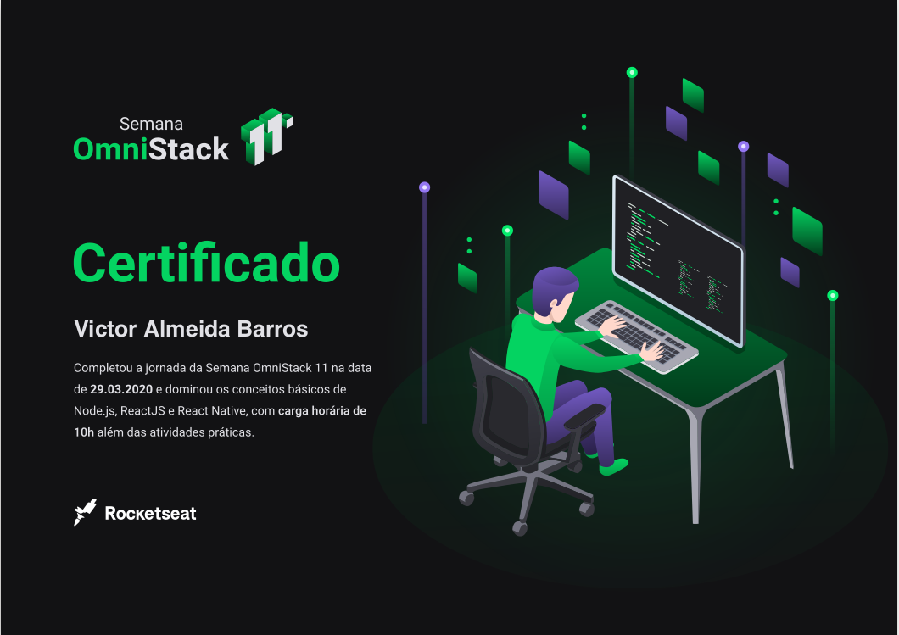

# OmniStack 11
### Victor Scratch

## Aula 1: Introduction
 - Hello world em node com express
 - npx create-react-app <nome> : inicia uma aplicação react

## Aula 2: Back com Node
 - knex
 - sqlite
 - npx knex init
 - npx knex migrate:make <nome da migration> ->cgera .js para definir o schema da tabela
 - npx knex migrate:latest -> Executa o arquivo da migration
 - npx knex migrate:rollback -> Ultima forma

### TODO: Terminar o docker file e up.sh para subirem a aplicação em containers.

## Aula3: Front com Reactive
 - 

## Certification

  

